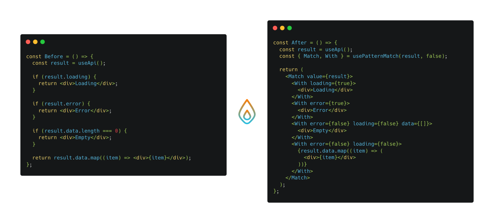

  

## Overview

- Typesafe, with helpful type inference
- Expressive API
- Supports predicates and not patterns for complex cases
- Tiny bundle footprint

  

## Documentation

Visit the [official website](https://react-matchez.netlify.app) to view the full documentation.

## Status

_react-matchez_ is in the early stages of development, and there might be a few
breaking changes here as I figure out how to:

- address some pattern matching principles (e.g. exhaustiveness)
- improve the overall type-safety
- simplify its API
- reduce its bundle size
