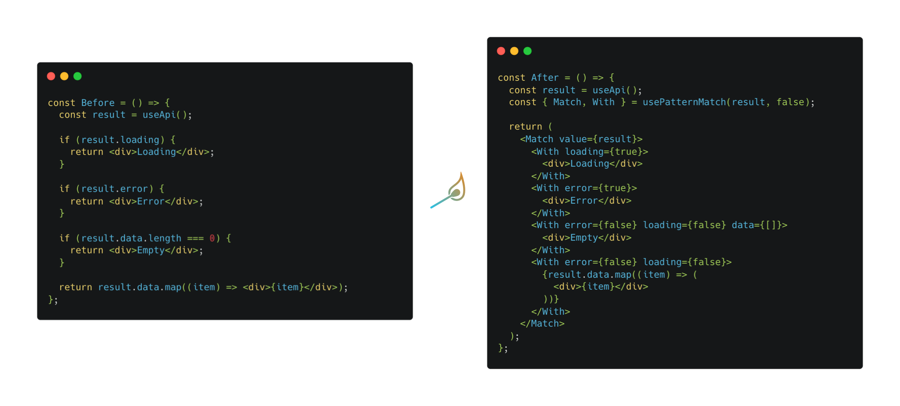

<p align="center">
  
</p>

# Introduction

<p align="center">
  
</p>

## Overview

- Typesafe, with helpful type inference
- Expressive API
- Supports predicates and not patterns for complex cases
- Tiny bundle footprint

## Getting Started

1. Install:

```sh
npm install react-match
yarn add react-match
```

2. Define what is the shape of the object you wanna branch on:

```typescript
export type Data =
  | { type: 'text'; content?: string }
  | { type: 'img'; src?: string };

export type Result =
  | { type: 'ok'; data: Data }
  | { type: 'cancel'; error?: Error };

export const result: Result = { type: 'ok', data: { type: 'img' } };
```

3. Pick one of the two approaches:

3.1. Using [`getPatternMatch`](#getpatternmatch)/[`usePatternMatch`](#usepatternmatch)

This one spares you from passing type parameters to each of your `With`/`When` cases.
This is ideal when you have only one `Match` within your component and should cover
most of the scenarios.

```tsx
import { getPatternMatch } from 'react-match';

const { Match, With, Otherwise } = getPatternMatch<Result, false>();

const Component = () => {
  return (
    <Match value={result}>
      <With type="cancel">Cancel</With>
      <With type="ok" data={{ type: 'text' }}>
        OK - Text
      </With>
      <With type="ok" data={{ type: 'img' }}>
        OK - Image
      </With>
      <Otherwise>Fallback</Otherwise>
    </Match>
  );
};
```

3.2. Using the original components + providing type parameters

This one is ideal when you have multiple `Match` occurrences within your component.
The downside is that you'll have to manually pass type parameters to all of your
`With`/`When` cases.

```tsx
import { Match, With, Otherwise } from 'react-match';

const Component = () => {
  return (
    <Match value={result}>
      <With<Result, false> type="cancel">Cancel</With>
      <With<Result, false> type="ok" data={{ type: 'text' }}>
        OK - Text
      </With>
      <With<Result, false> type="ok" data={{ type: 'img' }}>
        OK - Image
      </With>
      <Otherwise>Fallback</Otherwise>
    </Match>
  );
};
```

## Why Pattern Matching

Pattern matching consists of specifying patterns to which some data should conform, then checking to see if it does, and de-constructing the data according to those patterns.

This is implemented out of the box in languages like Haskell, Rust, and Elixir and has proven to be more powerful and less verbose than imperative alternatives (`if`/`else`/`switch` statements), especially when branching on complex data structures.

## Why react-match

Unfortunately, JavaScript and TypeScript weren’t designed with pattern matching in mind. Fortunately, there are some great initiatives to address it, e.g.:

- [Daggy](https://github.com/fantasyland/daggy) gives you the ability to define a type and values of this type (sum types) that you can then pattern match to declare an action depending on the value of this type.

- [ts-pattern](https://github.com/gvergnaud/ts-pattern) gives you exhaustive pattern matching with great type inference; being 100% tailored to bring declarative code branching to JavaScript/TypeScript—by the way, this library was some heavy inspiration to our API.

- Last but not least, there's even a [TC39 proposal](https://github.com/tc39/proposal-pattern-matching) from 2017 to add pattern matching to the EcmaScript specification.

Even though there are some interesting efforts in bringing pattern matching at a language level, what we lack are React/JSX abstractions for this.

React itself shifted our mindsets from imperatively manipulating the DOM to declaratively expressing what the DOM should look like for a given state. So it's only fair we take this even further with declarative render branching.

Unfortunately, most of the existing alternatives (like [react-pattern-matching](https://github.com/joshblack/react-pattern-matching) or [react-pattern-match](https://github.com/tkh44/react-pattern-match)) lack features, have poor/zero typing, and are unmaintained.

What we have, though, are domain-specific matching/branching solutions, for example:

- [react-router](https://github.com/remix-run/react-router): Declarative matching for routes
- [react-device-detect](https://github.com/duskload/react-device-detect): Declarative matching for device type
- [react-matches](https://github.com/souporserious/react-matches): Declarative matching for media queries

> **react-match** then comes as a first-class-React, generic, strongly-typed, solution that you can use to build your own domain-specific matching solutions—and reduce drastically the `if`/`else`/`switch` boilerplate from your components.

# Documentation

- [Introduction](#introduction)
  - [Overview](#overview)
  - [Getting Started](#getting-started)
  - [Why Pattern Matching](#why-pattern-matching)
  - [Why react-match](#why-react-match)
- [Documentation](#documentation)
- [API](#api)
  - [`Match`](#match)
    - [Overview](#overview-1)
    - [Props](#props)
  - [`Otherwise`](#otherwise)
    - [Overview](#overview-2)
    - [Props](#props-1)
  - [`When`](#when)
    - [Overview](#overview-3)
    - [Props](#props-2)
  - [`With`](#with)
    - [Overview](#overview-4)
    - [Props](#props-3)
  - [`getPatternMatch`](#getpatternmatch)
    - [Overview](#overview-5)
  - [`usePatternMatch`](#usepatternmatch)
    - [Overview](#overview-6)
  - [`not`](#not)
    - [Overview](#overview-7)
- [Roadmap](#roadmap)
- [Inspirations](#inspirations)

# API

## `Match`

### Overview

- This component is the wrapper for the matching cases.
- The only required prop is its `children`.
- Valid `children` for it are only: `With`, `When`, and `Otherwise`.
- If you plan on having `With` cases, then you need to pass a `value` prop.
- If you use the `otherwise` prop, then don't use the `Otherwise` component as children.

### Props

| Name                  | Type                      | Default value | Description                                                                                               |
| --------------------- | ------------------------- | ------------- | --------------------------------------------------------------------------------------------------------- |
| value                 | Shape                     |               | Entry point to create a pattern-matching expression.                                                      |
| children _(required)_ | \_MatchChildren&lt;Shape> |               | The patterns the `value` prop should match. Can be represented as `With`, `When`, and `Otherwise`.        |
| otherwise             | Element                   |               | A default value to be used if nothing matches. If used, then the `Otherwise` component should be omitted. |
| firstMatch            | boolean                   |               | Indicates whether anything that matches should render or only the first match.                            |

## `Otherwise`

### Overview

- This component represents your default/fallback state; meaning its children represent what's going to be rendered when nothing matches your previous `When`/`With` assertions.
- Shouldn't be used if you've already passed the `otherwise` prop to its `Match` parent.
- Shouldn't be used more than once within one `Match` parent.

### Props

| Name                  | Type      | Default value | Description                                                              |
| --------------------- | --------- | ------------- | ------------------------------------------------------------------------ |
| children _(required)_ | ReactNode |               | Any node to be rendered when nothing matches `With` and `When` siblings. |

## `When`

### Overview

- This component represents a **condition** to be satisfied.
- Its `children` will be rendered if the `predicate` function returns a truthy value.
- If you pass the `value` prop to its `Match` parent, it's going to be available as the first parameter of your `predicate` function.
- It takes one type parameter:
  - `Shape`: It's the shape of the `value` prop to its `Match` parent. Useful for type inference.

### Props

| Name                   | Type                       | Default value | Description                                                                                                                                                                   |
| ---------------------- | -------------------------- | ------------- | ----------------------------------------------------------------------------------------------------------------------------------------------------------------------------- |
| children _(required)_  | ReactNode                  |               | Any node to be rendered when the predicate matches.                                                                                                                           |
| predicate _(required)_ | (value?: Shape) => boolean |               | Condition to be satisfied for the `children` to be rendered. If the `value` prop was passed to its `Match` parent, then this predicate will expose it as its first parameter. |

## `With`

### Overview

- This component represents a **shape** to be matched.
- Its props are the pattern: the shape of value you expect for this branch.
- Its `children` will be rendered if the shape defined within its other props match the `value` prop passed to its `Match` parent.
- It takes two type parameters:
  - `Shape`: It's the shape of the `value` prop to its `Match` parent. Useful for type inference.
  - `Strict`: Indicates whether you want the compiler to make all the `Shape` properties deeply `required` in order to match.

### Props

| Name                  | Type      | Default value | Description                                                                                   |
| --------------------- | --------- | ------------- | --------------------------------------------------------------------------------------------- |
| children _(required)_ | ReactNode |               | Any node to be rendered when its other props match the `value` defined on its `Match` parent. |

## `getPatternMatch`

### Overview

- This function is a typing helper and returns typed versions of the components API—so that you don't have to manually type `With`, `When`, etc. each time you use them.
- It takes either:
  - Two **regular parameters**: `value` and `strict`. This alternative is ideal when you want the `Shape` to be inferred.
  - Two **type parameters**: `Shape` and `Strict`. This alternative is ideal when you have an `interface`/`type` for your `Shape` and you just want to pass them.

## `usePatternMatch`

### Overview

Just like `getPatternMatch`, but as a React hook.

## `not`

### Overview

- It enables you to match on everything but a specific value.
- It takes a pattern and returns its opposite.
- It's a re-export of `ts-pattern`'s [`not` function](https://github.com/gvergnaud/ts-pattern#notpattern).

# Roadmap

- [ ] Add unit tests
- [ ] Document recipes + common use cases
- [ ] Publish to npm
- [ ] Restrict the type of `Match`'s children to be only `With`, `When` and `Otherwise`
- [ ] Support exhaustive matching
- [ ] Support wildcard patterns
- [ ] Support extraction of pieces of the input value (aka _selectors_)

# Inspirations

This library has been heavily inspired by:

- [ts-pattern](https://github.com/gvergnaud/ts-pattern): A great library by [Gabriel Vergnaud](https://github.com/gvergnaud) that not only inspired the core and the APIs of `react-match` but is also used by our internals.

- [Daggy](https://github.com/fantasyland/daggy): A great library from the [Fantasy Land](https://github.com/fantasyland) universe that brings sum types to JavaScript. Using its `taggedSum` and `cata` methods, you can get really a really interesting taste of pattern matching.

- [ECMAScript pattern matching proposal](https://github.com/tc39/proposal-pattern-matching): This proposal briefly covers what the JSX syntax would look like. Even though `react-match` didn't quite use it as an inspiration, it was still an interesting reference.
